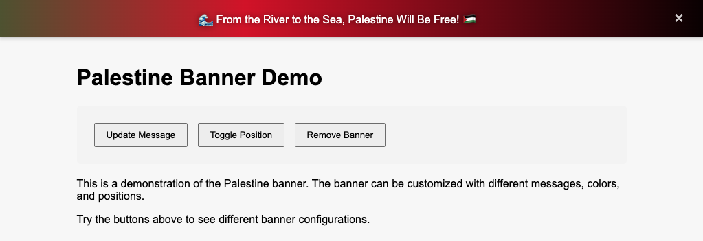

# Palestine Banner

A simple, customizable banner that can be easily embedded in any webpage to show support for Palestine and raise awareness about the ongoing genocide.

## Demo

Live demo link: [https://palestine-banner.vercel.app/](https://palestine-banner.vercel.app/)



## Features

- Easy to integrate
- Customizable message, colors, and position
- Responsive design
- No dependencies
- Simple API for dynamic updates
- Gradient background animation
- Optional close button
- Written in TypeScript with full type support

## Installation

### Package manager

```bash
npm install palestine-banner
```

### CDN

1. Download the `dist/index.js` file for basic usage or `dist/palestine-banner.js` file for more configuration options.
2. Include it in your HTML file:

```html
<script src="https://cdn.jsdelivr.net/npm/palestine-banner@1.0.1/dist/index.min.js"></script>
```

Or

```html
<script src="https://cdn.jsdelivr.net/npm/palestine-banner@1.0.1/dist/palestine-banner.js"></script>
```

## Usage

### Basic usage:

Adding the `dist/index.js` in the html file (check installation section) should be sufficient for basic usage.

For [nextjs](https://nextjs.org/) project we must import this file in a client component. Then render that component in the root layout component.

```typescript
"use client";
import "palestine-banner/dist/index";

export const PalestineBanner = () => {
  return null;
}
```


### Configuration Options

For more configurations we need to use `dist/palestine-banner.js` file.
Please check the `src/demo.ts` file for example.

| Option | Type | Default | Description |
|--------|------|---------|-------------|
| message | string | 'Free Palestine 🇵🇸' | The text to display in the banner |
| backgroundColor | string | 'linear-gradient(90deg, #000000 0%, #009639 33%, #CE1126 66%, #000000 100%)' | Background color or gradient of the banner |
| textColor | string | '#FFFFFF' | Text color of the banner |
| position | string | 'top' | Position of the banner ('top' or 'bottom') |
| fontSize | string | '16px' | Font size of the banner text |
| showCloseButton | boolean | true | Whether to show the close button |

### Methods

- `updateWithRandomMessage()`: Update the banner message with a randomly picket message
- `updateMessage(newMessage)`: Update the banner message
- `updateStyle(newStyle)`: Update the banner styles
- `remove()`: Remove the banner from the page
- `setPosition(newPosition)`: Set the banner position to `top` or `bottom` of the page
- `togglePosition()`: Toggle the banner position between `top` and `bottom` of the page

## Example

```javascript
// Create a banner
const banner = new PalestineBanner({
    message: 'Stop the Genocide 🕊️',
    backgroundColor: 'linear-gradient(90deg, #000000 0%, #009639 33%, #CE1126 66%, #000000 100%)',
    textColor: '#FFFFFF',
    position: 'top'
});

// Update the message
banner.updateMessage('🌊 From the River to the Sea, Palestine Will Be Free! 🇵🇸');

// Update styles
banner.updateStyle({
    backgroundColor: 'linear-gradient(90deg, #000000 0%, #009639 33%, #CE1126 66%, #000000 100%)',
    textColor: '#FFFFFF'
});

// Remove the banner
banner.remove();
```

## Development

1. Clone the repository
2. Install dependencies:
```bash
bun install
```
3. Start development server:
```bash
bun run dev
```
4. Build for production:
```bash
bun run build
```
5. Test the UI using `index.html` file:
You may want to use [LiveServer](https://marketplace.visualstudio.com/items?itemName=ritwickdey.LiveServer) for testing.

## License

MIT
